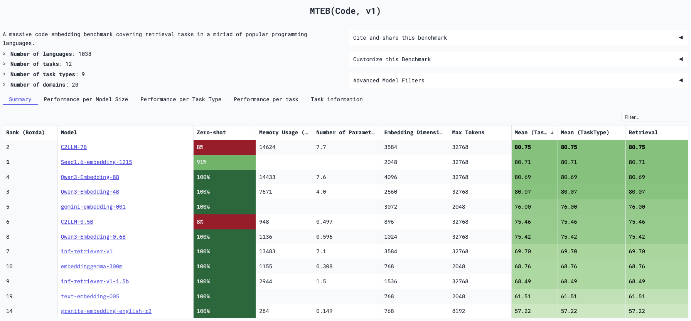
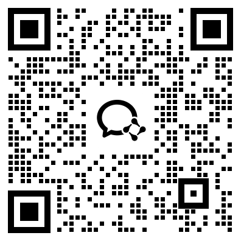

## C2LLM

**C2LLMs (Code Contrastive Large Language Models)** are powerful new models for generating code embeddings, designed to capture the deep semantics of source code.

#### Key Features

- **Powerful Base Model**: Built upon the state-of-the-art `Qwen2.5-Coder`, inheriting its exceptional code comprehension capabilities.
- **Intelligent Pooling with PMA**: Instead of traditional `mean pooling` or `last token pooling`, C2LLM uses **PMA (Pooling by Multi-head Attention)**. This allows the model to dynamically focus on the most critical parts of the code, creating a more informative and robust embedding.
- **Trained for Retrieval**: C2LLM was fine-tuned on a massive dataset of **3 million query-document pairs**, optimizing it for real-world code retrieval and semantic search tasks. Supporting Text2Code/Code2Code/Code2Text tasks.

C2LLM is designed to be a go-to model for tasks like code search and Retrieval-Augmented Generation (RAG). The models are available at [🤗codefuse-ai/C2LLM-7B](https://huggingface.co/codefuse-ai/C2LLM-7B), [🤗codefuse-ai/C2LLM-0.5B](https://huggingface.co/codefuse-ai/C2LLM-0.5B)

### Evaluation

As of December 2025, C2LLM-7B ranks 1st on MTEB-Code leaderboard, while C2LLM-0.5B ranks 6th overall and 1st among similar-sized models.

<p align="center">
    
<p>

### How to use

#### Usage (**HuggingFace Transformers**)

```Python
from transformers import AutoModel, AutoTokenizer
import torch
model_path = "codefuse-ai/C2LLM-7B"
# Load the model
model = AutoModel.from_pretrained(model_path, torch_dtype=torch.bfloat16, trust_remote_code=True)
# Prepare your custom instruction
instruction = "xxxxx"
# Prepare the data
sentences = ['''int r = (int) params >> 8 & 0xff;
int p = (int) params & 0xff;
byte[] derived1 = SCrypt.scrypt(passwd.getBytes("UTF-8"), salt, N, r, p, 32);
if (derived0.length != derived1.length) return false;
int result = 0;
for (int i = 0; i < derived0.length; i++) {
result |= derived0[i] ^ derived1[i];
}
return result == 0;
} catch (UnsupportedEncodingException e) {
throw new IllegalStateException("JVM doesn't support UTF-8?");
} catch (GeneralSecurityException e) {
throw new IllegalStateException("JVM doesn't support SHA1PRNG or HMAC_SHA256?");
}
}''',
'''
}
if (tempFrom > tempTo) {
return new RangeInfo(inclusive ? tempTo : tempTo + 1, tempFrom + 1, true);
}
return new RangeInfo(tempFrom, inclusive ? tempTo + 1 : tempTo, false);
}''']
sentences = [instruction+sentence for sentence in sentences]
# Get the embeddings
embeddings = model.encode(sentences)
```

#### Usage (**Sentence-Transformers**)

```python
from sentence_transformers import SentenceTransformer
# Load the model
model = SentenceTransformer("codefuse-ai/C2LLM-7B", trust_remote_code=True, tokenizer_kwargs={"padding_side":"left"})
# Prepare your custom instruction
instruction = "xxxxx"
# Prepare the data
sentences = ['''int r = (int) params >> 8 & 0xff;
int p = (int) params & 0xff;
byte[] derived1 = SCrypt.scrypt(passwd.getBytes("UTF-8"), salt, N, r, p, 32);
if (derived0.length != derived1.length) return false;
int result = 0;
for (int i = 0; i < derived0.length; i++) {
result |= derived0[i] ^ derived1[i];
}
return result == 0;
} catch (UnsupportedEncodingException e) {
throw new IllegalStateException("JVM doesn't support UTF-8?");
} catch (GeneralSecurityException e) {
throw new IllegalStateException("JVM doesn't support SHA1PRNG or HMAC_SHA256?");
}
}''',
'''
}
if (tempFrom > tempTo) {
return new RangeInfo(inclusive ? tempTo : tempTo + 1, tempFrom + 1, true);
}
return new RangeInfo(tempFrom, inclusive ? tempTo + 1 : tempTo, false);
}''']
sentences = [instruction+sentence for sentence in sentences]
# Get the embeddings
embeddings = model.encode(sentences)
```

#### Evaluation (**MTEB**)

```python
from sentence_transformers import SentenceTransformer
from mteb.models import ModelMeta
from mteb.cache import ResultCache
model_name = "codefuse-ai/C2LLM-7B"
# Load the model
model = mteb.get_model(model_name) # if the model is not implemented in MTEB it will be eq. to SentenceTransformer(model_name)
# Select tasks
tasks = mteb.get_tasks(tasks=["AppsRetrieval", "CodeSearchNetCCRetrieval", "CodeEditSearchRetrieval","CodeSearchNetRetrieval","CodeFeedbackMT","CodeFeedbackST","CodeTransOceanContest","CodeTransOceanDL","COIRCodeSearchNetRetrieval","CosQA","StackOverflowQA","SyntheticText2SQL"])
# Cache the result
cache = ResultCache("./c2llm_results")
# Evaluate
results = mteb.evaluate(model, tasks=tasks, cache=cache, encode_kwargs={"batch_size": 16})
```

### Support Us

If you find this project helpful, please give it a star. It means a lot to us!

[](https://github.com/codefuse-ai/CodeFuse-Embeddings/tree/main)

You are also welcom to cite our technical report:

```
@article{2025C2LLM,
  title={C2LLM Technical Report: A New Frontier in Code Retrieval via Adaptive Cross-Attention Pooling}, 
      author={Jin Qin and Zihan Liao and Ziyin Zhang and Hang Yu and Peng Di and Rui Wang},
  journal      = {CoRR},
  volume       = {abs/2512.21332},
  year         = {2025},
  url          = {https://doi.org/10.48550/arXiv.2512.21332},
  doi          = {10.48550/ARXIV.2512.21332},
  eprinttype    = {arXiv},
  eprint       = {2512.21332}
}
```

### Contact us

Email: <hyu.hugo@antgroup.com>



### Acknowledgement

Thanks to the authors of open-sourced datasets, including CSN, Adv, CoSQA.
